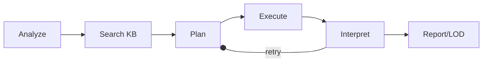

# Purple Engine: Agentic CTF Orchestrator

> **B.Tech Final Year Project | Modernizing CTF-Katana**

--------------------------

**Purple Engine** is a state-of-the-art agentic AI system for Capture The Flag (CTF) challenges. Built on the foundation of [John Hammond's CTF-Katana](https://github.com/JohnHammond/katana), it reimagines security automation as a collaborative **Red Team** (Offensive/Research) and **Blue Team** (Defensive/Hardening) orchestration.

Powered by a locally deployed [MCP (Model Context Protocol)](https://modelcontextprotocol.io/) server and [Ollama](https://ollama.com/), the Purple Engine provides a complete end-to-end ecosystem:
- **Red Team Agents**: Analyze artifacts, plan exploitation strategies, and execute research.
- **Blue Team Agents**: Generate hardened challenges, obfuscate flags, and verify security posture.
- **Human-in-the-Loop (HITL)**: Prioritizes educational walkthroughs so you learn while the agents solve.

## Quick Start

### 1. Prerequisites

| Requirement | Version |
|-------------|---------|
| Python | ≥ 3.10 |
| [Ollama](https://ollama.com/) | any recent release |

Ensure you have your preferred reasoning model pulled (e.g., **mistral**, **llama3**, or **deepseek-coder**):
```bash
ollama pull mistral
```

### 2. Installation

```bash
git clone https://github.com/djmahe4/ctf-katana.git
cd ctf-katana
pip install -e ".[dev]"
```

### 3. Launching the Engine

The engine runs as an MCP server. You can launch it directly or via your desktop agent.

```bash
# Start the MCP server
katana-server
```

#### Claude Desktop Integration
Add the engine to your `claude_desktop_config.json`:
```json
{
  "mcpServers": {
    "purple-engine": {
      "command": "katana-server"
    }
  }
}
```

## The Purple Engine Loop

The system operates in a deterministic six-step loop for autonomous solving:



1. **Analyze**: `agent_analyze` identifies artifact types and suggests initial techniques.
2. **Search**: Queries the [Legacy Knowledge Base](KNOWLEDGE_BASE.md) for pre-canned commands.
3. **Plan**: `agent_plan` builds a tactical implementation strategy.
4. **Execute**: 22+ specialized skill tools carry out the heavy lifting.
5. **Interpret**: Agents review results to detect flags or adjust the plan.
6. **Report (HITL)**: `agent_report` generates human-readable walkthroughs and PoCs.

## Capability Registry (22 Skills)

The Purple Engine exposes a dynamic registry of 22 specialized security skills, categorised by domain:

- **Analysis**: Metadata extraction, encoding identification.
- **Crypto**: Multi-tier ciphers, brute-force cracking, RSA attacks.
- **Stego**: LSB analysis, file carving, strings extraction.
- **Forensics**: Magic numbers, PDF extraction, binary analysis.
- **Web**: Protocol headers, JWT decoding, vulnerability fuzzing.
- **Reverse Engineering**: Disassembly, symbol analysis, ELF/PE inspection.
- **Pwn**: Buffer overflow offsets, ROP gadget mapping.
- **Blue Team/Hardening**: Anti-AI flag obfuscation (the `flagger` skill).

## Project Ecosystem

- `server/`: MCP orchestration and skill discovery.
- `skills/`: The core registry of 22 offensive/defensive capabilities.
- `agents/`: Ollama-backed reasoning intelligence.
- `context/`: Knowledge base parsers and system prompts.
- `docs/`: Detailed blueprints, history, and the new **Purple Engine** roadmap.

---

### Legacy Data
The original ~1800 lines of tool listings have been moved to [KNOWLEDGE_BASE.md](KNOWLEDGE_BASE.md) to keep this documentation focused on the engine's architecture.
