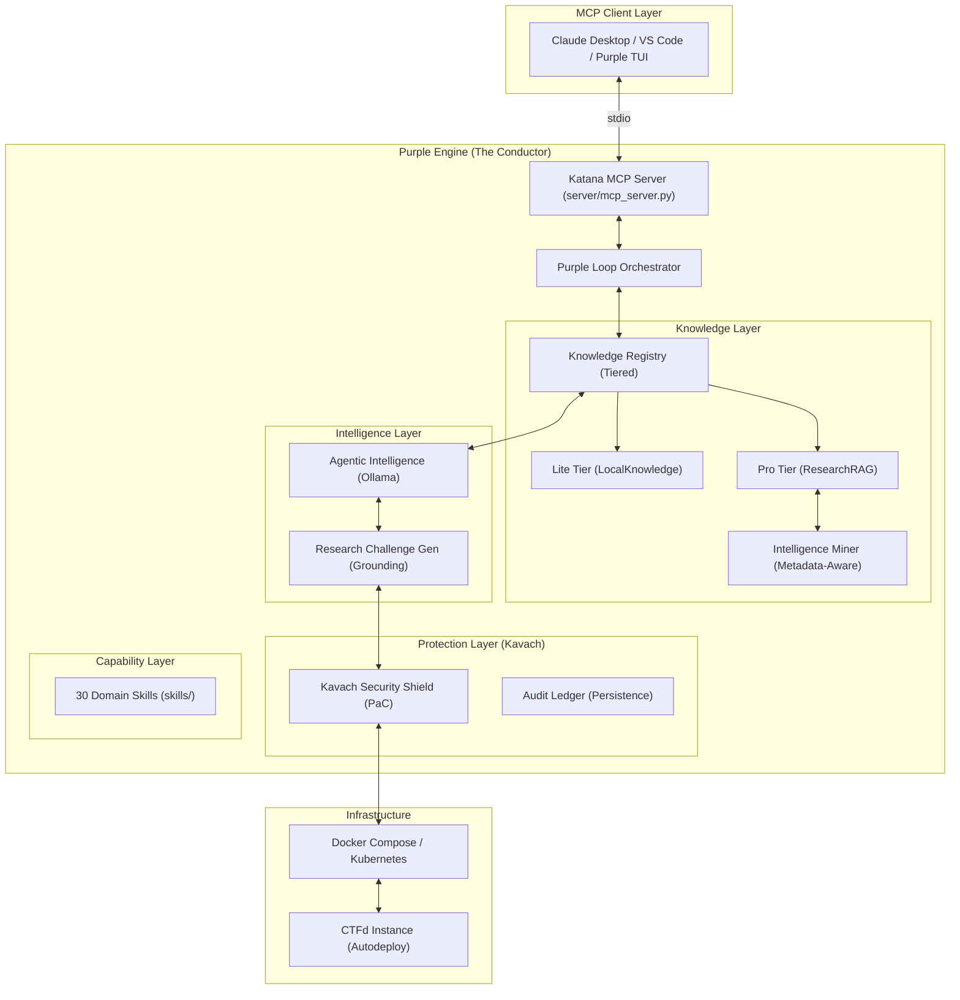

# Purple Engine: System Architecture

This document describes the internal design of the **Purple Engine** – an autonomous agentic AI ecosystem that orchestrates Red Team offensive research, Blue Team defensive hardening, and environment synthesis.

## System Overview

The Purple Engine operates as a local [Model Context Protocol (MCP)](https://modelcontextprotocol.io/) server, providing a **Synthesis-to-Shield** pipeline. It uses a tiered knowledge architecture to ensure synthesis fidelity.



## Core Components

### 1. Purple Loop Orchestrator (`skills/purple_loop_orchestrator/`)
The "Conductor" managing the 4-phase transformation:
- **Research**: CVE/Technique analysis using tiered intelligence.
- **Synthesize**: Metadata-aware environment generation with exploit/patch grounding.
- **Solve**: Agentic solving (Analyzer -> Planner -> Executor).
- **Harden**: Applying Kavach PaC policies and Flagger obfuscation.

### 2. Tiered Knowledge Management
The system enforces a strict hierarchy for information retrieval:
- **Tier 1 (Lite)**: Fast, markdown-based lookup of local tools and manual techniques.
- **Tier 2 (Pro)**: ChromaDB-backed semantic RAG indexing high-signal security research targets. 
    - **Core Targets**: Web3 (`Slither`, `OpenZeppelin`), Cloud (`Pacu`, `Prowler`), Pwn (`Kernel-Exploitation`, `Pwntools`), Mobile (`DroidClaw`), and IoT (`Embedded-Systems-VR`).
    - **Triggered-Only Sync**: To reduce synthesis overhead, repository indexing is "Triggered-Only" (via `registry.sync_all_knowledge()`) rather than automatic.
- **Intelligence Miner**: Performs JIT scraping of specific CVE advisories, tagging snippets with `language_hint` and `source_extension` to ensure strict grounding during the Purple Loop.

### 3. Synthesis Fidelity & Grounding
`ResearchChallengeGen` uses explicit grounding prompts. It validates that synthesized code follows the patterns found in exploit/patch snippets.
- **Language Fidelity**: Detects target language using metadata hints before LLM generation.
- **Build Consistency**: Automatically generates required artifacts like `Makefile` (for Pwn/IoT) or `hardhat.config.js` (for Web3) if the LLM omits them.

### 4. Kavach Security Shield (`skills/firewall/`)
Reimagined as a **Protection-as-Code (PaC)** orchestrator:
- **Environment Scaffolding**: Automated hardening of Docker/K8s manifests.
- **Multi-Level Tripwires**: `AUDIT` (passive logging) vs `ENFORCEMENT` (active termination).
- **Audit Ledger**: A centralized log of all security events.

## Capability Matrix (30 Skills)

| Domain | Skills |
| :--- | :--- |
| **Defense & Shielding** | `firewall` (Kavach), `flagger` |
| **Intelligence & Research** | `research_agent`, `research_rag`, `research_swarm`, `research_vuln_discovery`, `research_challenge_gen`, `research_chrome_scraper` |
| **Web & Exploit** | `web` (Synthesis), `web_exploit`, `exploitation`, `fuzzing`, `recon` |
| **Binary & Mobile** | `binary_exploit`, `reverse`, `reverse_engineering`, `android`, `iot_embedded`, `arm_cortex` |
| **Specialized Solvers** | `crypto_solver`, `stego_solver`, `forensics`, `web3`, `reentrancy`, `heap_exploit` |
| **Orchestration** | `purple_loop_orchestrator`, `registry_manage`, `ctfd_setup`, `ctfd_solve`, `ctfd_manage`, `superpowers`, `writeup_generator` |

## Directory Layout

```text
.
├── server/                    # MCP server core & tiered registry
├── skills/
│   ├── firewall/              # Blue Team: Kavach Security Shield
│   ├── web/                   # Red Team: Web Synthesis & Exploitation
│   ├── purple_loop_orchestrator/ # The Conductor (Master Loop)
│   └── ...                    # 30 self-contained security skills
├── agents/                    # Ollama-backed reasoning intelligence
├── data/                      # Persistent research_db & repo cache
├── docs/                      # System documentation & progress logs
└── configs/                   # Deployment and security policies
```

## Future Roadmap (Phase 5)
0. **Purple Dashboard**: Interactive TUI/GUI for monitoring the unified pipeline
1. **End-to-End Validation**: Automated Red-Blue loop verification suite.
2. **Metadata Similarity Score**: Quantifying how well a generated challenge matches source intelligence.
3. **Enterprise K8s Support**: Full Helm chart generation for large-scale CTF events.
