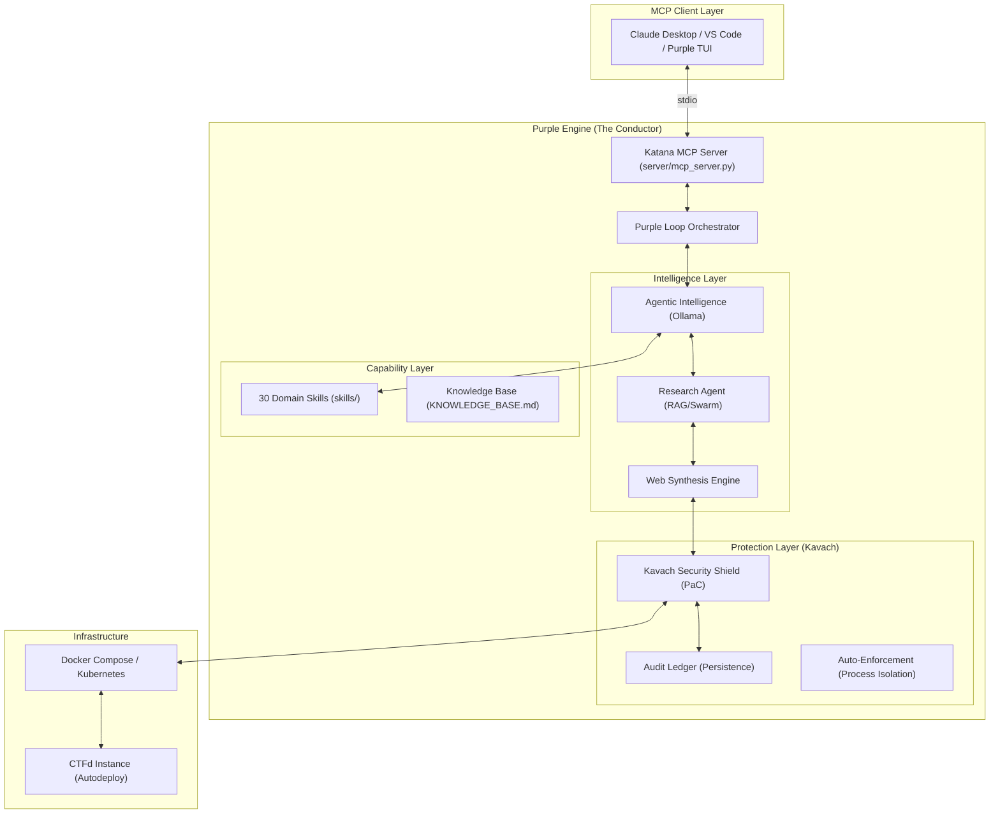

# Purple Engine: System Architecture

This document describes the internal design of the **Purple Engine** – an autonomous agentic AI ecosystem that orchestrates Red Team offensive research, Blue Team defensive hardening, and environment synthesis.

## System Overview

The Purple Engine operates as a local [Model Context Protocol (MCP)](https://modelcontextprotocol.io/) server, providing a **Synthesis-to-Shield** pipeline for secure, end-to-end CTF challenge management.



## Core Components

### 1. Purple Loop Orchestrator (`skills/purple_loop_orchestrator/`)
The "Conductor" of the entire pipeline. It manages the state machine for the 4-phase transformation:
- **Research**: CVE/Technique analysis.
- **Synthesize**: Environment & Exploit generation.
- **Solve**: Agentic solving (Analyzer -> Planner -> Executor).
- **Harden**: Applying Kavach PaC policies and Flagger obfuscation.

### 2. Kavach Security Shield (`skills/firewall/`)
Reimagined as a **Protection-as-Code (PaC)** orchestrator. Kavach provides:
- **Environment Scaffolding**: Automated hardening of Docker/K8s manifests.
- **Multi-Level Tripwires**: `AUDIT` (passive logging for challenges) vs `ENFORCEMENT` (active termination for agent isolation).
- **Audit Ledger**: A centralized log of all security events across the pipeline.

### 3. Web Synthesis Engine (`skills/web/engines/`)
Automates the generation of vulnerable, yet hardened, CTF environments. It supports standard stacks (Nginx, Tomcat, Uvicorn) and produces production-ready `docker-compose.yml` artifacts.

### 4. Dynamic Skill Registry
Automatically discovers 30+ specialized security skills across 5 domains. Each skill provides reasoning prompts and execution logic.

## Capability Matrix (30 Skills)

| Domain | Skills |
| :--- | :--- |
| **Defense & Shielding** | `firewall` (Kavach), `flagger` |
| **Intelligence & Research** | `research_agent`, `research_rag`, `research_swarm`, `research_vuln_discovery`, `research_challenge_gen`, `research_chrome_scraper` |
| **Web & Exploit** | `web` (Synthesis), `web_exploit`, `exploitation`, `fuzzing`, `recon` |
| **Binary & Mobile** | `binary_exploit`, `reverse`, `reverse_engineering`, `android`, `iot_embedded`, `arm_cortex` |
| **Specialized Solvers** | `crypto_solver`, `stego_solver`, `forensics`, `web3`, `reentrancy`, `heap_exploit` |
| **Orchestration** | `purple_loop_orchestrator`, `ctfd_setup`, `ctfd_solve`, `ctfd_manage`, `superpowers`, `writeup_generator` |

## Directory Layout

```text
.
├── server/                    # MCP server core & skill registry
├── skills/                    # 30 self-contained security skills
│   ├── firewall/              # Blue Team: Kavach Security Shield
│   ├── web/                   # Red Team: Web Synthesis & Exploitation
│   ├── purple_loop_orchestrator/ # The Conductor (Master Loop)
│   └── ...
├── agents/                    # Ollama-backed reasoning intelligence
├── docs/                      # System documentation & progress logs
└── configs/                   # Deployment and security policies
```

## Future Roadmap (Phase 5)
1. **Purple Dashboard**: Interactive TUI/GUI for monitoring the unified pipeline.
2. **End-to-End Validation**: Automated Red-Blue loop verification suite.
3. **Enterprise K8s Support**: Full Helm chart generation for large-scale CTF events.
