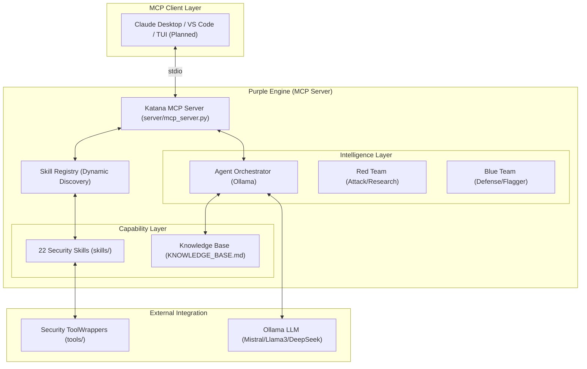

# Purple Engine: System Architecture

This document describes the internal design of the **Purple Engine** (a modernized CTF-Katana) – an agentic AI ecosystem that orchestrates Red Team offensive research, Blue Team defensive hardening, and Human-in-the-Loop (HITL) learning.

## System Overview

The Purple Engine operates as a local [Model Context Protocol (MCP)](https://modelcontextprotocol.io/) server, exposing security-domain-specific tools and reasoning agents to any MCP-compatible client.



## Core Components

### 1. Unified MCP Server (`server/mcp_server.py`)
The central entry point built with `FastMCP`. it exposes:
- **Resources**: Structured views of the `KNOWLEDGE_BASE.md` (metadata, sections, categories).
- **Tools**: 50+ callable functions, including 22 domain-specific skills and 4 reasoning agent endpoints.
- **Prompts**: Standardized workflows for analysis and solving.

### 2. Dynamic Skill Registry (`server/registry.py`)
Decouples execution logic from the server. It automatically discovers and loads security skills by scanning the `skills/` directory. Each skill is a self-contained unit:
- `skill.yaml`: Metadata, input schemas, and categorization.
- `prompt.md`: Reasoning instructions for the agent when using this skill.
- `run.py`: The deterministic execution logic (e.g., calling `nmap` or `binwalk`).

### 3. Agentic Intelligence (`agents/`)
The "Brain" of the Purple Engine. Four specialized agents handle high-level reasoning:
- **AnalyzerAgent**: Classifies artifacts and suggests techniques.
- **PlannerAgent**: Builds the tactical "Red vs Blue" strategy.
- **ExecutorAgent**: Interprets tool outputs and decides on retries or pivots.
- **ReporterAgent**: Generates educational write-ups (HITL) and PoC exploits.

### 4. Purple Team Specialization
Distinct from generic security tools, the Purple Engine integrates specific offensive and defensive logic:
- **Red Team (Offense)**: Leveraging `exploitation`, `fuzzing`, and `reversing` skills for autonomous solving.
- **Blue Team (Defense)**: Utilizing the `flagger` and `firewall` skills for challenge hardening and anti-AI obfuscation.

### 5. Knowledge Context (`context/`)
- **`knowledge_base.py`**: A specialized parser for [KNOWLEDGE_BASE.md](KNOWLEDGE_BASE.md). It transforms thousands of lines of legacy CTF research into a searchable RAG context for agents.
- **`system_prompt.md`**: Defines the "Purple Engine" identity, enforcing the Red/Blue orchestration and educational focus.

## Directory Layout

```text
.
├── KNOWLEDGE_BASE.md          # 1800+ lines of legacy CTF research (RAG source)
├── README.md                  # Project landing page
├── server/                    # MCP server core & skill registry
├── skills/                    # 22 self-contained security skills
│   ├── flagger/               # Blue Team: Anti-AI flag hardening
│   ├── exploitation/          # Red Team: Offensive research
│   └── ...
├── tools/                     # Thin CLI wrappers for external binaries
├── agents/                    # Ollama-backed reasoning intelligence
├── context/                   # Knowledge base parsers & system prompts
└── configs/                   # Model and skill feature flags
```

## Future Roadmap (Phase 5)
1. **TUI/GUI Layer**: Interactive dashboard for the Purple Engine ecosystem.
2. **Integration Testing**: End-to-end verification of the Red-Blue solving loop.
3. **Automated Deployment**: One-click deployment via Ollama/Docker configurations.
